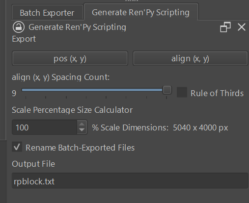

# Generate Ren'Py Scripting

Generate Ren'Py Scripting is a Python plugin for Krita. GRS outputs a block of Ren'Py scripting to display the images of the active Krita document as they appear on the canvas, working in tandem with the [krita-batch-exporter](https://github.com/GDQuest/krita-batch-exporter). The output file is automatically opened so that you may immediately copy and paste the text into your Ren'Py project. The idea is to make working between Ren'Py and Krita as efficient as possible!

# How to Use

 1. Determine the image export scale you are going to use. The included Scale Percentage Size Calculator will tell you the dimensions of the image at the given scale; for Ren'Py, you'll likely want to get it close to 1920x1080 pixels.
 2. Batch export the image's elements using KBE (krita-batch-exporter). This means that the layers you wish to export must follow the syntax defined in the [KBE manual](https://github.com/GDquest/krita-batch-exporter/blob/master/batch_exporter/Manual.md). The layer name (the actual name substring) will be used as the image name in the Ren'Py script.
 3. (Optional) Customize the name of the output file (rpblock.txt by default). Do so if you wish to make and save multiple output files, though the practical use is to have rpblock.txt as a temporary file akin to scratch paper.
 4. Choose your output type.
	1. If you need `pos (x, y)` scripting, press `pos (x, y)`.
    2. If you need align (x, y) scripting:
       1. Choose the number of evenly-distributed spacings to use.  The Rule of Thirds toggle has the same effect as choosing 4 spacings [0.0, 0.333, 0.666, 1.0].
       2. Press `align (x, y)`.
  5. The exported file will be opened in the program default for its type automatically. Copy and paste its text where you need it in your Ren'Py script.
  6. Make any changes necessary to your Ren'Py script. GRS gets you started with the basic image display template, but any further ATL statements still need to be declared manually!

For more information with examples, see the [manual](https://github.com/SeanHRN/generate-renpy-scripting/blob/master/manual.md).

# Download and Installation
Quickest Way via Python Plugin Manager (from Web):
Open Krita and go to `Tools -> Scripts -> Import Python Plugin from Web`.
Enter as the download URL: https://github.com/SeanHRN/generate-renpy-scripting

Alternatively:
Download the [zip or tar.gz](https://github.com/SeanHRN/generate-renpy-scripting/releases/tag/v1.0.0).

Easy Install via Python Plugin Manager (from File):
Open Krita and go to `Tools -> Scripts -> Import Python Plugin from File`.  Select `generateRenpyScripting_1.0.zip`.

Long Way:
Unzip `generate-renpy-scripting-1.0.0.zip`. Place `generateRenpyScripting` (the folder)  and `generateRenpyScripting.desktop` in the pykrita directory.
You may find the location of the pykrita folder by opening Krita and clicking  `Settings -> Manage Resources -> Open Resource Folder`.

Proceed to Enabling GRS in Krita.

# Enabling GRS in Krita
1. Open Krita.
2. Go to `Settings -> Configure Krita -> Python Plugin Manager`.
3. `Generate Ren'Py Scripting` will be in the list; check its box.
4.  Restart Krita.

# Known Issue

 - The image dimensions section of the Scale Percentage Size Calculator doesn't automatically update when a Krita document is opened.

# Feedback
Do you have suggestions on how to make the plugin better? Are there any commonly-used templates that you want to see as export options? Send a message to my [krita-artists.org page](https://krita-artists.org/u/HyDrone/summary).

# License
Generate Ren'Py Scripting is released under the GNU General Public License (version 3 or later).
